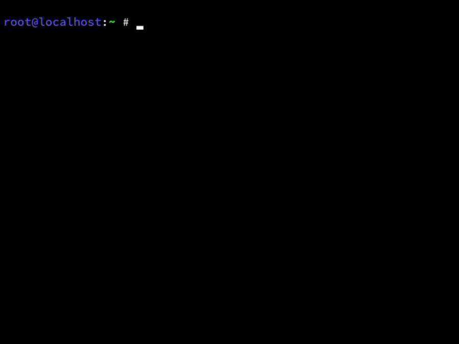
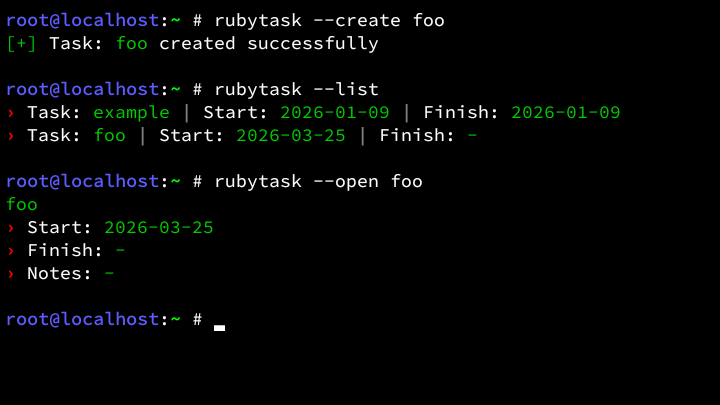
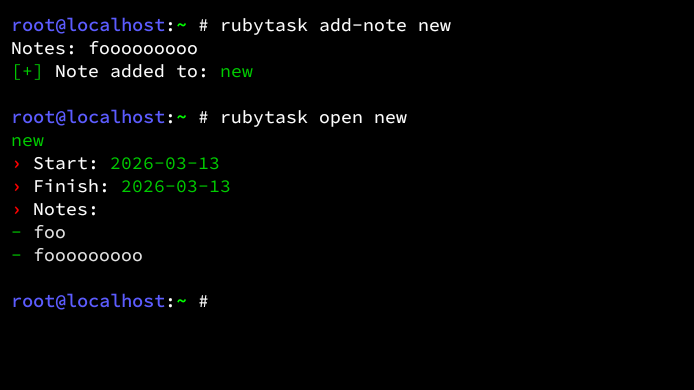
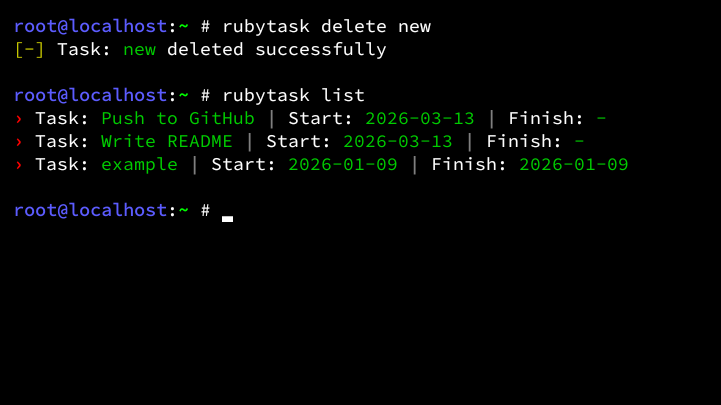
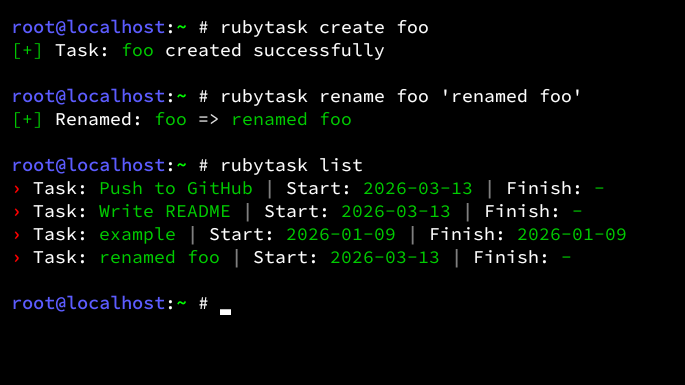

<!-- Rubytask Project -->

[]()
[]()
[](LICENSE)

# Rubytask
Rubytask is a lightweight CLI tool for managing tasks and notes with zero dependencies. <br>

## Preview
<details>
<summary>Show Preview</summary>
<br>

<br><br>

<br><br>

<br><br>

<br><br>

<br>
</details>

## Features
- Create new tasks
- View a list of all tasks
- Open and view task details
- Mark tasks as completed
- Delete tasks
- Add notes to a task
- Rename existing tasks

## Testing
<table>
	<tr>
		<th>OS</th>
		<th>Version</th>
	</tr>
	<tr>
		<td>Debian</td>
		<td>Trixie</td>
	</tr>
    <tr>
        <td>Ubuntu</td>
        <td>25.10</td>
    </tr>
	<tr>
		<td>Kali</td>
		<td>Rolling</td>
	</tr>
	<tr>
		<td>Termux</td>
		<td>0.118.3</td>
	</tr>
</table>

## Installation
```bash
git clone https://github.com/Zeronetsec/Rubytask.git
cd Rubytask
chmod +x install.sh
./install.sh
```

## Usage
``` bash
rubytask create <name> [<date>]
rubytask list
rubytask open <name>
rubytask finish <name>
rubytask delete <name>
rubytask add-note <name>
rubytask rename <name> <new_name>
rubytask --help
rubytask --version
```

## License
This project is licensed under the MIT License. <br>

<!-- Copyright (c) 2026 Zeronetsec -->